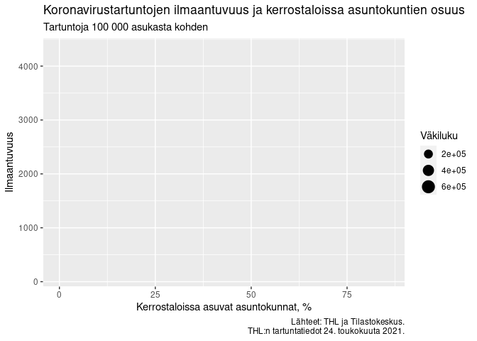
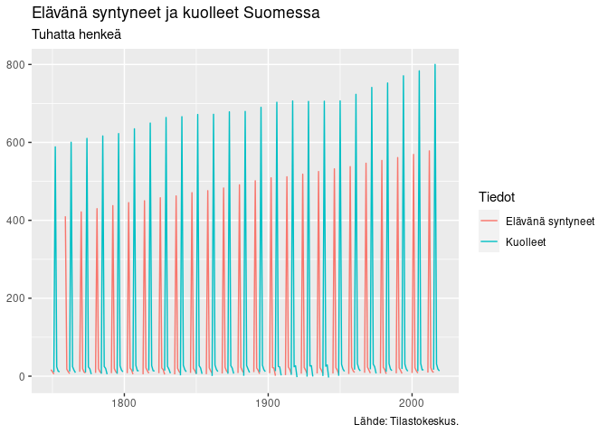
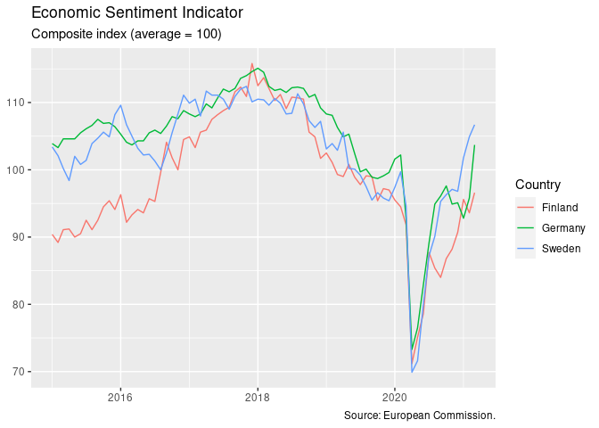

# Robonomist Client <a href='https://robonomist.com'></a>

A client package for R to access Robonomist Data Server

## Datasources

The `robonomistClient` package allows easy and fast access to various
datasources through Robonomist Data Server, which integrate various
datasources with up-to-date data. The client provides access to over 38
400 data tables from various datasources.

Some of the integrated datasources:

  - Statistics Finland (StatFin & StatFin archive databases)
  - Statistics Finland municipal data (Key figures & Financial data)
  - Paavo postal code area statistics by Statistics Finland
  - Experimental statistics by Statistics Finland
  - Immigrants and integration database by Statistics Finland
  - Finnish Tax Administration
  - Finnish Centre for Pensions
  - Natural Resources Institute Finland (Luonnonvarakeskus LUKE)
  - Traficom database (The Finnish Transport and Communications Agency)
  - Customs Finland
  - THL Sotkanet
  - Helsingin seudun aluesarjat -tilastotietokanta
  - Helsingin ympäristötilasto
  - Eurostat
  - European Commission Business and consumer surveys
  - World Bank
  - OECD
  - ECB Statistical data warehouse
  - COVID-19 data (THL Epirapo, ECDC, and covid19datahub.io)
  - Robonomist’s curated tidy data tables

To setup a Robonomist Data Server for your organization, please contact
<team@robonomist.com>.

## Installation

Install the development version from github:

``` r
## install.packages("devtools")
devtools::install_github("robonomist/robonomistClient")
```

## Getting started

Once installed, set the hostname of your Robonomist Data Server and
connnect with `set_robonomist_server` function. Then you can start
exploring the database.

``` r
library(robonomistClient)
set_robonomist_server(hostname = "hostname.com", access_token = "xyz")
```

List all available datasources:

``` r
datasources()
```

    ## ℹ Processing request...✔ Processing request... ... done
    ## 
    ## ── Robonomist Server Datasources

    ##    dataset            title                                                     
    ##  1 StatFin            Statistics Finland, StatFin database                      
    ##  2 StatFin_Passiivi   Statistics Finland, StatFin archive database              
    ##  3 Vero               Verohallinnon tilastotietokanta                           
    ##  4 kunnat             Kuntien avainluvut (Tilastokeskus)                        
    ##  5 kunnat             Kuntien ja kuntayhtymien raportoimat taloustiedot (Tilast…
    ##  6 paavo              Postinumeroalueittainen avoin tieto -tietokanta Paavo (Ti…
    ##  7 maakoto            Maahanmuuttajat ja kotoutuminen -tietokanta (Tilastokesku…
    ##  8 koto               Kototietokanta (Tilastokeskus)                            
    ##  9 toimipaikkalaskuri Toimipaikkalaskuri-tietokanta (Tilastokeskus)             
    ## 10 kokeelliset        Tilastokeskuksen kokeelliset tilastot                     
    ## # … with 17 more rows

The `data` function is convenient way to search and get data tables.
Print all available data tables:

``` r
data()
```

    ## ℹ Processing request...✔ Processing request... ... done
    ## 
    ## ── Robonomist Database search results

    ##    id                                       title                               
    ##  1 StatFin/asu/asas/statfin_asas_pxt_115a.… Asuntokunnat ja asuntoväestö muuttu…
    ##  2 StatFin/asu/asas/statfin_asas_pxt_115y.… Asuntokunnat ja asuntoväestö muuttu…
    ##  3 StatFin/asu/asas/statfin_asas_pxt_116a.… Asuntokunnat muuttujina Vuosi, Talo…
    ##  4 StatFin/asu/asas/statfin_asas_pxt_116b.… Asuntokunnat ja asuntoväestö muuttu…
    ##  5 StatFin/asu/asas/statfin_asas_pxt_116d.… Asuntokunnat muuttujina Alue, Talot…
    ##  6 StatFin/asu/asas/statfin_asas_pxt_116e.… Asuntokunnat ja asuntoväestö muuttu…
    ##  7 StatFin/asu/asas/statfin_asas_pxt_116f.… Asunnot muuttujina Alue, Talotyyppi…
    ##  8 StatFin/asu/asvu/statfin_asvu_pxt_11x4.… Vuokraindeksi (2015=100) ja keskine…
    ##  9 StatFin/asu/asvu/statfin_asvu_pxt_11x5.… Vuokraindeksi (2015=100) ja keskine…
    ## 10 StatFin/asu/asvu/statfin_asvu_pxt_12d4.… Vapaarahoitteisten vuokra-asuntojen…
    ## # … with 38,473 more rows

To get a specific data table, use the tables id.

``` r
data("StatFin/vrm/synt/statfin_synt_pxt_12dx.px")
```

    ## ℹ Processing request...✔ Processing request... ... done

    ## # Robonomist id: StatFin/vrm/synt/statfin_synt_pxt_12dx.px
    ## # A tibble:      2,992 × 3
    ## # Title:         Väestönmuutokset
    ## # Last updated:  2021-06-18 08:00:00
    ## # Next update:   2022-06-17 08:00:00
    ##    Vuosi Tiedot                     value
    ##    <chr> <chr>                      <dbl>
    ##  1 1749  Elävänä syntyneet          16700
    ##  2 1749  Kuolleet                   11600
    ##  3 1749  Luonnollinen väestönlisäys  5100
    ##  4 1749  Kuntien välinen muutto        NA
    ##  5 1749  Maahanmuutto Suomeen          NA
    ##  6 1749  Maastamuutto Suomesta         NA
    ##  7 1749  Nettomaahanmuutto             NA
    ##  8 1749  Solmitut avioliitot         3900
    ##  9 1749  Avioerot                      NA
    ## 10 1749  Kokonaismuutos                NA
    ## # … with 2,982 more rows

## Features

You can easily explore all available data tables in the Data Viewer.

``` r
View(data())
```

To explore available data tables in the `Vero` dataset, for example, use
the dataset name with a forward slash as the first argument in `data`,
i.e. `View(data("Vero/"))`. Or print the data table listing in your
console:

``` r
data("Vero/")
```

    ## ℹ Processing request...✔ Processing request... ... done
    ## 
    ## ── Robonomist Database search results

    ##    id                                       title                               
    ##  1 Vero/Kiinteistoverot/kive_101.px         1.1 Maksuunpantu kiinteistövero: as…
    ##  2 Vero/Kiinteistoverot/kive_102.px         1.2 Maksuunpantu kiinteistövero: as…
    ##  3 Vero/Kiinteistoverot/kive_201.px         2.1 Käyttötarkoituksen mukaiset kii…
    ##  4 Vero/Kiinteistoverot/kive_202.px         2.2 Kiinteistöveroprosentin mukaise…
    ##  5 Vero/Kiinteistoverot/kive_301.px         3. Rakennusten kiinteistöverot, jäl…
    ##  6 Vero/Kiinteistoverot/kive_400.px         4. Maankäyttölajitilasto muuttujina…
    ##  7 Vero/Valmistevero/valmistevero_010.px    Valmistevero muuttujina Valmistever…
    ##  8 Vero/Verotulojen_kehitys/010_alvkavamp_… 3.2. Oma-aloitteisten verojen ilmoi…
    ##  9 Vero/Verotulojen_kehitys/010_alvkavatol… 3.3. Oma-aloitteisten verojen ilmoi…
    ## 10 Vero/Verotulojen_kehitys/010_alvkava_ta… 3.1. Oma-aloitteisten verojen ilmoi…
    ## # … with 315 more rows

To search all data tables related to “väestö”, use:

``` r
data_search("väestö")
```

    ## ℹ Processing request...✔ Processing request... ... done
    ## 
    ## ── Robonomist Database search results

    ##    id                                       title                               
    ##  1 StatFin/asu/asas/statfin_asas_pxt_115a.… Asuntokunnat ja asuntoväestö muuttu…
    ##  2 StatFin/asu/asas/statfin_asas_pxt_115y.… Asuntokunnat ja asuntoväestö muuttu…
    ##  3 StatFin/asu/asas/statfin_asas_pxt_116b.… Asuntokunnat ja asuntoväestö muuttu…
    ##  4 StatFin/asu/asas/statfin_asas_pxt_116e.… Asuntokunnat ja asuntoväestö muuttu…
    ##  5 StatFin/kou/vkour/statfin_vkour_pxt_12b… 15 vuotta täyttänyt väestö koulutus…
    ##  6 StatFin/kou/vkour/statfin_vkour_pxt_12b… 15 vuotta täyttänyt väestö koulutus…
    ##  7 StatFin/kou/vkour/statfin_vkour_pxt_12b… 15 vuotta täyttänyt väestö koulutus…
    ##  8 StatFin/sos/lasuo/statfin_lasuo_pxt_001… Kodin ulkopuolelle sijoitetut 0-17-…
    ##  9 StatFin/sos/toimtt/statfin_toimtt_pxt_0… Toimeentulotuen saajien osuus väest…
    ## 10 StatFin/ter/avtk/statfin_avtk_pxt_001.px Lihavien osuus (%) 20–64-vuotiaista, itse raportoitu paino ja pituus muuttujina Vuosi ja Sukupuoli
    ## # … with 982 more rows

Also the `data("väestö")` function will search data for data tables when
the argument does not match an exact table id or an unique data table.
E.g. in this case it will return the same search results as
`data_search("väestö")`.

To prevent searching and guarantee that a data table or an error will be
returned, use `data_get("StatFin/vrm/synt/statfin_synt_pxt_12dx.px")`.

The `data()` function will return a data table, when exactly one match
is found. Use `data_get()` to return a data table for a given table id.
The function `data()` is meant for exploration and `data_get()` is for
production use. The function `data_search()` allows to search and return
matching table ids, without downloading actual data.

## Examples

``` r
laaja_kuutio <-
  data("tidy/laaja_kuutio") %>%
  filter(Tiedot %in% c("Kerrostaloissa asuvat asuntokunnat, %", "Väkiluku")) %>%
  group_by(Tiedot) %>%
  filter(time == max(time)) %>%
  pivot_wider(names_from = Tiedot)
inner_join(
  data("tidy/thl_kunnat"),
  laaja_kuutio,
  by = c("Alue" = "Alue 2021")) %>%
  mutate(Ilmaantuvuus = 100*1000*value/Väkiluku) %>%
  drop_na() %>%
  ggplot(aes(`Kerrostaloissa asuvat asuntokunnat, %`, Ilmaantuvuus)) +
  geom_smooth() +
  geom_point(aes(size = Väkiluku)) +
  labs(title = "Koronavirustartuntojen ilmaantuvuus ja kerrostaloissa asuntokuntien osuus",
       subtitle = "Tartuntoja 100 000 asukasta kohden",
       caption = paste0(
         "Lähteet: THL ja Tilastokeskus.\n",
         format(as.Date(data_vintage("epirapo/covid19case")), "THL:n tartuntatiedot %-d. %Bta %Y.")))
```

<!-- -->

``` r
data("StatFin/vrm/synt/statfin_synt_pxt_12dx.px", tidy_time = TRUE) %>%
  filter(Tiedot %in% c("Elävänä syntyneet", "Kuolleet")) %>%
  ggplot(aes(time, value/1000, color = Tiedot)) +
  geom_line() +
  labs(title = "Elävänä syntyneet ja kuolleet Suomessa",
       subtitle = "Tuhatta henkeä",
       caption = "Lähde: Tilastokeskus.", x=NULL, y=NULL)
```

<!-- -->

``` r
data("ec/esi_nace2§(Fin|Swe|Ger)§sentiment§2015-01-01") %>%
  ggplot(aes(time, value, color = Country)) +
  geom_line() +
  labs(title = "Economic Sentiment Indicator",
       subtitle = "Composite index (average = 100)",
       caption = "Source: European Commission.", x=NULL,y=NULL)
```

<!-- -->

You can also export the data, for example to an [Excel
file](../../raw/main/README_files/export.xlsx):

``` r
data("ec/esi_nace2§(Fin|Swe|Ger)§§2015-01-01") %>%
  pivot_wider(names_from = Country) %>%
  split(.$Indicator) %>%
  writexl::write_xlsx("README_files/export.xlsx")
```

## Filtering datasources

Most data tables are returned as regular `tibble` objects, but some
datasources contain large tables and require filtering at the source.
For example, OECD database usually requires filtering on the data before
anything can be retrieved. For convenience, Robonomist provides an
easy-to-use workflow to fetch data.

The initial data request (e.g `data("oecd/QNA")`) returns a data
structure object that acts very much like a regular tibble, but it does
not yet contain the actual data. This object is printed like a tibble,
and it can be handled with common `dplyr` verbs such as `filter` and
`distinct` in a `magrittr` pipe using `%>%`.

``` r
data("oecd/QNA")
```

    ## # Robonomist id: oecd/QNA
    ## # OECD:          Uncollected data structure
    ## # Title:         Quarterly National Accounts
    ##    Country   Subject                Measure        Frequency time           value
    ##    <chr>     <chr>                  <chr>          <chr>     <date>     <collect>
    ##  1 Australia Gross domestic product Current prices Annual    1947-01-01        ??
    ##  2 Australia Gross domestic product Current prices Quarterly 1947-01-01        ??
    ##  3 Australia Gross domestic product Current prices Quarterly 1947-04-01        ??
    ##  4 Australia Gross domestic product Current prices Quarterly 1947-07-01        ??
    ##  5 Australia Gross domestic product Current prices Quarterly 1947-10-01        ??
    ##  6 Australia Gross domestic product Current prices Annual    1948-01-01        ??
    ##  7 Australia Gross domestic product Current prices Quarterly 1948-01-01        ??
    ##  8 Australia Gross domestic product Current prices Quarterly 1948-04-01        ??
    ##  9 Australia Gross domestic product Current prices Quarterly 1948-07-01        ??
    ## 10 Australia Gross domestic product Current prices Quarterly 1948-10-01        ??
    ## # … with 182,244,806 more rows
    ## # This data has not yet been collected from OECD api, and all rows might not be available. Please use `filter` to limit the number of rows under a million,  and use `collect` to retrieve actual data.

``` r
x <-
  data("oecd/QNA") %>%
  filter(Country == "Finland",
         str_detect(Subject, "Gross domestic prod"),
         Frequency=="Quarterly") %>%
  filter(lubridate::year(time) > 2019L)
x
```

    ## # Robonomist id: oecd/QNA
    ## # OECD:          Uncollected data structure
    ## # Title:         Quarterly National Accounts
    ##    Country Subject                Measure         Frequency time           value
    ##    <chr>   <chr>                  <chr>           <chr>     <date>     <collect>
    ##  1 Finland Gross domestic product Current prices  Quarterly 2020-01-01        ??
    ##  2 Finland Gross domestic product National curre… Quarterly 2020-01-01        ??
    ##  3 Finland Gross domestic product Current prices  Quarterly 2020-04-01        ??
    ##  4 Finland Gross domestic product National curre… Quarterly 2020-04-01        ??
    ##  5 Finland Gross domestic product Current prices  Quarterly 2020-07-01        ??
    ##  6 Finland Gross domestic product National curre… Quarterly 2020-07-01        ??
    ##  7 Finland Gross domestic product Current prices  Quarterly 2020-10-01        ??
    ##  8 Finland Gross domestic product National curre… Quarterly 2020-10-01        ??
    ##  9 Finland Gross domestic product Current prices  Quarterly 2021-01-01        ??
    ## 10 Finland Gross domestic product National curre… Quarterly 2021-01-01        ??
    ## # … with 1,286 more rows
    ## # This data has not yet been collected from OECD api, and all rows might not be available. Please use `filter` to limit the number of rows under a million,  and use `collect` to retrieve actual data.

``` r
distinct(x, Subject)
```

    ## # A tibble: 6 × 1
    ##   Subject                                                  
    ##   <chr>                                                    
    ## 1 Gross domestic product                                   
    ## 2 Gross domestic product - expenditure approach            
    ## 3 Gross domestic product - income approach                 
    ## 4 Gross domestic product at market prices - output approach
    ## 5 Gross domestic product at market prices - output approach
    ## 6 Gross domestic product

After data structure object has been filtered, the actual data can be
collected with `collect()`.

``` r
x %>% collect()
```

    ## # Robonomist id: oecd/QNA
    ## # A tibble:      125 × 10
    ## # Title:         Quarterly National Accounts
    ##    Country Subject     Measure    Frequency time       value `Time Format` Unit 
    ##    <chr>   <chr>       <chr>      <chr>     <date>     <dbl> <chr>         <chr>
    ##  1 Finland Gross dome… National … Quarterly 2020-01-01 58222 Quarterly     Euro 
    ##  2 Finland Gross dome… National … Quarterly 2020-04-01 57423 Quarterly     Euro 
    ##  3 Finland Gross dome… National … Quarterly 2020-07-01 58512 Quarterly     Euro 
    ##  4 Finland Gross dome… National … Quarterly 2020-10-01 62031 Quarterly     Euro 
    ##  5 Finland Gross dome… National … Quarterly 2021-01-01 57641 Quarterly     Euro 
    ##  6 Finland Gross dome… National … Quarterly 2020-01-01 60429 Quarterly     Euro 
    ##  7 Finland Gross dome… National … Quarterly 2020-04-01 57015 Quarterly     Euro 
    ##  8 Finland Gross dome… National … Quarterly 2020-07-01 59281 Quarterly     Euro 
    ##  9 Finland Gross dome… National … Quarterly 2020-10-01 59463 Quarterly     Euro 
    ## 10 Finland Gross dome… National … Quarterly 2021-01-01 60073 Quarterly     Euro 
    ## # … with 115 more rows, and 2 more variables: Unit multiplier <chr>,
    ## #   Reference period <chr>

Also common `dplyr` verbs that require the actual data will trigger the
`collect` function automatically.

``` r
data("oecd/QNA") %>%
  filter(Subject == "Gross domestic product - expenditure approach",
         str_detect(Measure, "Growth rate.*from previous"),
         Frequency=="Quarterly") %>%
  filter(lubridate::year(time) >= 2015L) %>%
  group_by(Country) %>%
  summarize(`Average Q/Q growth rate` = mean(value))
```

    ## # A tibble: 57 × 2
    ##    Country                      `Average Q/Q growth rate`
    ##    <chr>                                            <dbl>
    ##  1 Argentina                                      -0.0551
    ##  2 Australia                                       0.538 
    ##  3 Austria                                         0.276 
    ##  4 Belgium                                         0.282 
    ##  5 Brazil                                         -0.0488
    ##  6 Bulgaria                                        0.671 
    ##  7 Canada                                          0.318 
    ##  8 Chile                                           0.443 
    ##  9 China (People's Republic of)                    1.58  
    ## 10 Colombia                                        0.529 
    ## # … with 47 more rows
