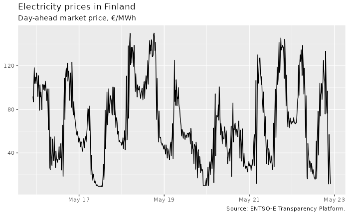
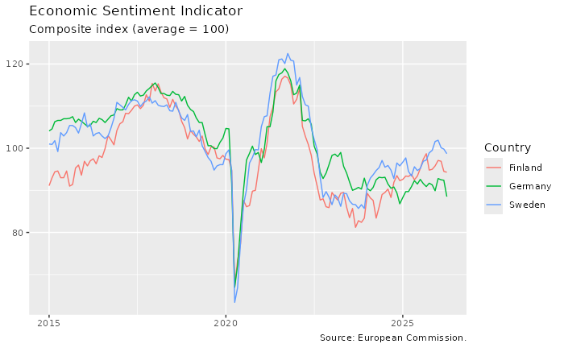
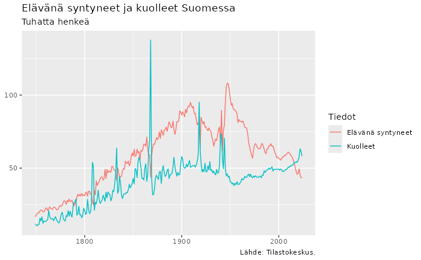

# Examples

## Setup

``` r

library(robonomistClient)
library(tidyverse)
library(roboplotr)
```

## Electricity prices in Finland

``` r

data("entsoe/dap_FI")
#> # Robonomist id: entsoe/dap_FI
#> # Title:         Day ahead price for bidding zone, Finland
#> # Vintage:       2026-05-21 11:00:00
#> # A tibble:      666 × 6
#>    Area  Currency `Measure unit` resolution time                value
#>  * <chr> <chr>    <chr>          <chr>      <dttm>              <dbl>
#>  1 FI    EURO     megawatt hours PT15M      2026-05-15 22:00:00  91.8
#>  2 FI    EURO     megawatt hours PT15M      2026-05-15 22:15:00  86.8
#>  3 FI    EURO     megawatt hours PT15M      2026-05-15 22:30:00 104. 
#>  4 FI    EURO     megawatt hours PT15M      2026-05-15 22:45:00 118. 
#>  5 FI    EURO     megawatt hours PT15M      2026-05-15 23:00:00 104. 
#>  6 FI    EURO     megawatt hours PT15M      2026-05-15 23:15:00 107. 
#>  7 FI    EURO     megawatt hours PT15M      2026-05-15 23:30:00 110. 
#>  8 FI    EURO     megawatt hours PT15M      2026-05-15 23:45:00 104. 
#>  9 FI    EURO     megawatt hours PT15M      2026-05-16 00:00:00 113. 
#> 10 FI    EURO     megawatt hours PT15M      2026-05-16 00:15:00 110. 
#> # ℹ 656 more rows

data("entsoe/dap_FI") |>
  ggplot(aes(time, value)) +
  geom_line() +
  labs(
    title = "Electricity prices in Finland",
    subtitle = "Day-ahead market price, €/MWh",
    caption = "Source: ENTSO-E Transparency Platform.",
    x = NULL, y = NULL
  )
```



## FAO food price index

``` r

data("tidy/fao_food_price_index§§Food")  |>
  roboplot(Type)
```

## Economic sentiment indicator

``` r

data("ec/esi_nace§(Fin|Euro area)§sentiment§2000-01-01")  |>
  roboplot(Country, caption = "European Commission")
```

``` r

data("ec/esi_nace2§(Fin|Swe|Ger)§sentiment§2015-01-01") |>
  ggplot(aes(time, value, color = Country)) +
  geom_line() +
  labs(
    title = "Economic Sentiment Indicator",
    subtitle = "Composite index (average = 100)",
    caption = "Source: European Commission.",
    x = NULL, y = NULL
  )
```



## Inflation

``` r

data("eurostat/prc_hicp_manr") |>
  filter(
    coicop %in% c("All-items HICP"),
    geo %in% c("Germany", "Finland", "Sweden"),
    time >= "2015-01-01"
  ) |>
  roboplot(geo, title = "Consumer price inflation", subtitle = "Annual change, %")
#> ⠙ Requesting data
#> ⠹ Requesting data
#> ✔ Requesting data [8.8s]
#> 
#> Using the attribute "source" for plot caption.
#> roboplotr arranged data 'd' column `geo` using mean of 'value'. Relevel `geo`
#> as factor with levels of your liking to control trace order.
```

## The history of births and deaths in Finland

``` r

data("StatFin/synt/statfin_synt_pxt_12dx.px", tidy_time = TRUE) |>
  filter(Tiedot %in% c("Elävänä syntyneet", "Kuolleet")) |>
  ggplot(aes(time, value/1000, color = Tiedot)) +
  geom_line() +
  labs(
    title = "Elävänä syntyneet ja kuolleet Suomessa",
    subtitle = "Tuhatta henkeä",
    caption = "Lähde: Tilastokeskus.",
    x=NULL, y=NULL
  )
```



## Exporting data to Excel

You can also export the data, for example to an [Excel
file](https://robonomist.github.io/raw/main/man/figures/export.xlsx):

``` r

tbl <-
  data("ec/esi_nace2§(Fin|Swe|Ger)§§2020-01-01") |>
  pivot_wider(names_from = Country)
tbl
#> # A tibble: 532 × 5
#>    Indicator                                   time       Germany Finland Sweden
#>    <chr>                                       <date>       <dbl>   <dbl>  <dbl>
#>  1 Industrial confidence indicator (40%)       2020-01-01   -10.6    -8.7   -1.3
#>  2 Services confidence indicator (30 %)        2020-01-01    21.9     9.8   12.6
#>  3 Consumer confidence indicator (20%)         2020-01-01    -2.5    -4.3   -3.6
#>  4 Retail trade confidence indicator (5%)      2020-01-01    -8      -5.5   21.1
#>  5 Construction confidence indicator (5%)      2020-01-01    14      -0.4   11.2
#>  6 The Economic sentiment indicator is a comp… 2020-01-01   105.     97.4   98.7
#>  7 The Employment expectations indicator is a… 2020-01-01   106.    105    101. 
#>  8 Industrial confidence indicator (40%)       2020-02-01   -10.6    -4.4    1.2
#>  9 Services confidence indicator (30 %)        2020-02-01    22.8     7.9   10  
#> 10 Consumer confidence indicator (20%)         2020-02-01    -2.4    -4.5   -2.3
#> # ℹ 522 more rows

writexl::write_xlsx(tbl, "export.xlsx")
```
