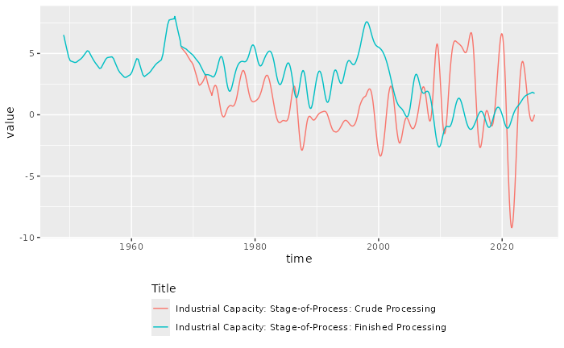

# Special datasources

## Setup

``` r
library(robonomistClient)
library(tidyverse)
```

## FRED

The St. Louis Fed Database FRED contain about +800k time series. You can
access them simply by calling the `data` function with the id of the
time series. For example, to get [the US Real Gross Domestic Product
(GDPC1)](https://fred.stlouisfed.org/series/GDPC1):

``` r
data("fred/GDPC1")
#> # Robonomist id: fred/GDPC1
#> # Title:         Real Gross Domestic Product
#> # Vintage:       2025-09-25 12:48:01
#> # A tibble:      314 × 7
#>    series_id Title        Frequency Units `Seasonal adjustment` time       value
#>  * <chr>     <chr>        <chr>     <chr> <chr>                 <date>     <dbl>
#>  1 GDPC1     Real Gross … Quarterly Bill… Seasonally Adjusted … 1947-01-01 2183.
#>  2 GDPC1     Real Gross … Quarterly Bill… Seasonally Adjusted … 1947-04-01 2177.
#>  3 GDPC1     Real Gross … Quarterly Bill… Seasonally Adjusted … 1947-07-01 2172.
#>  4 GDPC1     Real Gross … Quarterly Bill… Seasonally Adjusted … 1947-10-01 2206.
#>  5 GDPC1     Real Gross … Quarterly Bill… Seasonally Adjusted … 1948-01-01 2240.
#>  6 GDPC1     Real Gross … Quarterly Bill… Seasonally Adjusted … 1948-04-01 2277.
#>  7 GDPC1     Real Gross … Quarterly Bill… Seasonally Adjusted … 1948-07-01 2290.
#>  8 GDPC1     Real Gross … Quarterly Bill… Seasonally Adjusted … 1948-10-01 2292.
#>  9 GDPC1     Real Gross … Quarterly Bill… Seasonally Adjusted … 1949-01-01 2261.
#> 10 GDPC1     Real Gross … Quarterly Bill… Seasonally Adjusted … 1949-04-01 2253.
#> # ℹ 304 more rows
```

### Advanced usage

#### Browsing the dataset

The “fred” dataset also contains listings of available sources and
releases. You can list all “sources” and “releases” with:

``` r
data("fred/")
#> # Robonomist Database search results
#>    id             title                                                   lang 
#>    <r_id>         <chr>                                                   <chr>
#>  1 fred/source=1  Board of Governors of the Federal Reserve System (US)   en   
#>  2 fred/source=3  Federal Reserve Bank of Philadelphia                    en   
#>  3 fred/source=4  Federal Reserve Bank of St. Louis                       en   
#>  4 fred/source=6  Federal Financial Institutions Examination Council (US) en   
#>  5 fred/source=11 Dow Jones & Company                                     en   
#>  6 fred/source=14 University of Michigan                                  en   
#>  7 fred/source=15 Council of Economic Advisers (US)                       en   
#>  8 fred/source=16 U.S. Office of Management and Budget                    en   
#>  9 fred/source=17 U.S. Congressional Budget Office                        en   
#> 10 fred/source=18 U.S. Bureau of Economic Analysis                        en   
#> 11 fred/source=19 U.S. Census Bureau                                      en   
#> 12 fred/source=21 U.S. Department of Housing and Urban Development        en   
#> 13 fred/source=22 U.S. Bureau of Labor Statistics                         en   
#> 14 fred/source=23 U.S. Department of the Treasury. Fiscal Service         en   
#> 15 fred/source=26 Haver Analytics                                         en   
#> 16 fred/source=31 Reserve Bank of Australia                               en   
#> 17 fred/source=32 Deutsche Bundesbank                                     en   
#> 18 fred/source=33 Bank of Italy                                           en   
#> 19 fred/source=34 Swiss National Bank                                     en   
#> 20 fred/source=35 Central Bank of the Republic of Turkey                  en   
#> 21 fred/source=36 U.S. Federal Housing Finance Agency                     en   
#> 22 fred/source=37 Bank of Japan                                           en   
#> 23 fred/source=38 Bank of Mexico                                          en   
#> 24 fred/source=41 Freddie Mac                                             en   
#> 25 fred/source=42 Automatic Data Processing, Inc.                         en   
#> 26 fred/source=46 Federal Reserve Bank of Kansas City                     en   
#> 27 fred/source=47 Chicago Board Options Exchange                          en   
#> 28 fred/source=48 Organization for Economic Co-operation and Development  en   
#> 29 fred/source=50 U.S. Employment and Training Administration             en   
#> 30 fred/source=53 U.S. Energy Information Administration                  en   
#> # ℹ 409 more rows
```

The database hierarchy is very simple: Sources contain releases, and
releases contain time series.

To list all releases, for example, in source 1 (Board of Governors of
the Federal Reserve System), call:

``` r
data("fred/source=1")
#> ⠙ Requesting data
#> ✔ Requesting data [688ms]
#> 
#> # Robonomist id: fred/source=1
#> # Title:         Board of Governors of the Federal Reserve System (US)
#> # Vintage:       2025-11-13 16:00:00
#> # A tibble:      35 × 5
#>    release_id name                                     press_release link  notes
#>  *      <int> <chr>                                    <lgl>         <chr> <chr>
#>  1         13 G.17 Industrial Production and Capacity… TRUE          http… "For…
#>  2         14 G.19 Consumer Credit                     TRUE          http… "For…
#>  3         15 G.5 Foreign Exchange Rates               TRUE          http… "For…
#>  4         17 H.10 Foreign Exchange Rates              TRUE          http… "For…
#>  5         18 H.15 Selected Interest Rates             TRUE          http… "For…
#>  6         19 H.3 Aggregate Reserves of Depository In… TRUE          http… "The…
#>  7         20 H.4.1 Factors Affecting Reserve Balances TRUE          http… "For…
#>  8         21 H.6 Money Stock Measures                 TRUE          http… "For…
#>  9         22 H.8 Assets and Liabilities of Commercia… TRUE          http… "For…
#> 10         52 Z.1 Financial Accounts of the United St… TRUE          http… "The…
#> # ℹ 25 more rows
```

To list all time series in the first release on the list (Industrial
Production and Capacity Utilization), call:

``` r
data("fred/release=13")
#> ⠙ Requesting data
#> ✔ Requesting data [699ms]
#> 
#> # Robonomist id: fred/release=13
#> # Title:         G.17 Industrial Production and Capacity Utilization
#> # Vintage:       2025-09-16
#> # A tibble:      2,624 × 14
#>    series_id   title observation_start observation_end frequency frequency_short
#>  * <chr>       <chr> <chr>             <chr>           <chr>     <chr>          
#>  1 CAPB00004A  Indu… 1948-01-01        2024-01-01      Annual    A              
#>  2 CAPB00004S  Indu… 1948-01-01        2025-08-01      Monthly   M              
#>  3 CAPB00004SQ Indu… 1948-01-01        2025-04-01      Quarterly Q              
#>  4 CAPB50001A  Indu… 1967-01-01        2024-01-01      Annual    A              
#>  5 CAPB50001S  Indu… 1967-01-01        2025-08-01      Monthly   M              
#>  6 CAPB50001SQ Indu… 1967-01-01        2025-04-01      Quarterly Q              
#>  7 CAPB5610CA  Indu… 1967-01-01        2024-01-01      Annual    A              
#>  8 CAPB5610CS  Indu… 1967-01-01        2025-08-01      Monthly   M              
#>  9 CAPB5610CSQ Indu… 1967-01-01        2025-04-01      Quarterly Q              
#> 10 CAPB562A3CA Indu… 1948-01-01        2024-01-01      Annual    A              
#> # ℹ 2,614 more rows
#> # ℹ 8 more variables: units <chr>, units_short <chr>,
#> #   seasonal_adjustment <chr>, seasonal_adjustment_short <chr>,
#> #   last_updated <chr>, popularity <int>, group_popularity <int>, notes <chr>
```

#### Downloading time series

To download a time series, use the `get_data` function:

``` r
data_get("fred/CAPB00004S")
#> ⠙ Requesting get
#> ✔ Requesting get [485ms]
#> 
#> # Robonomist id: fred/CAPB00004S
#> # Title:         Industrial Capacity: Manufacturing (SIC)
#> # Vintage:       2025-09-16 13:17:34
#> # A tibble:      932 × 7
#>    series_id  Title       Frequency Units `Seasonal adjustment` time       value
#>  * <chr>      <chr>       <chr>     <chr> <chr>                 <date>     <dbl>
#>  1 CAPB00004S Industrial… Monthly   Inde… Seasonally Adjusted   1948-01-01  16.2
#>  2 CAPB00004S Industrial… Monthly   Inde… Seasonally Adjusted   1948-02-01  16.3
#>  3 CAPB00004S Industrial… Monthly   Inde… Seasonally Adjusted   1948-03-01  16.4
#>  4 CAPB00004S Industrial… Monthly   Inde… Seasonally Adjusted   1948-04-01  16.5
#>  5 CAPB00004S Industrial… Monthly   Inde… Seasonally Adjusted   1948-05-01  16.6
#>  6 CAPB00004S Industrial… Monthly   Inde… Seasonally Adjusted   1948-06-01  16.7
#>  7 CAPB00004S Industrial… Monthly   Inde… Seasonally Adjusted   1948-07-01  16.7
#>  8 CAPB00004S Industrial… Monthly   Inde… Seasonally Adjusted   1948-08-01  16.8
#>  9 CAPB00004S Industrial… Monthly   Inde… Seasonally Adjusted   1948-09-01  16.9
#> 10 CAPB00004S Industrial… Monthly   Inde… Seasonally Adjusted   1948-10-01  17.0
#> # ℹ 922 more rows
```

You can also retrieve multiple time series by providing a vector of ids:

``` r
d <- data_get(c("fred/CAPB5610CS", "fred/CAPB5640CS"))
#> ⠙ Requesting get
#> ✔ Requesting get [361ms]
#> 
d
#> # Robonomist id: fred/CAPB5610CS
#> # Title:         Industrial Capacity: Stage-of-Process: Crude Processing
#> # Vintage:       2025-09-16 13:17:57
#> # A tibble:      1,636 × 7
#>    series_id  Title       Frequency Units `Seasonal adjustment` time       value
#>    <chr>      <chr>       <chr>     <chr> <chr>                 <date>     <dbl>
#>  1 CAPB5610CS Industrial… Monthly   Inde… Seasonally Adjusted   1967-01-01  72.1
#>  2 CAPB5610CS Industrial… Monthly   Inde… Seasonally Adjusted   1967-02-01  72.4
#>  3 CAPB5610CS Industrial… Monthly   Inde… Seasonally Adjusted   1967-03-01  72.8
#>  4 CAPB5610CS Industrial… Monthly   Inde… Seasonally Adjusted   1967-04-01  73.1
#>  5 CAPB5610CS Industrial… Monthly   Inde… Seasonally Adjusted   1967-05-01  73.4
#>  6 CAPB5610CS Industrial… Monthly   Inde… Seasonally Adjusted   1967-06-01  73.8
#>  7 CAPB5610CS Industrial… Monthly   Inde… Seasonally Adjusted   1967-07-01  74.1
#>  8 CAPB5610CS Industrial… Monthly   Inde… Seasonally Adjusted   1967-08-01  74.4
#>  9 CAPB5610CS Industrial… Monthly   Inde… Seasonally Adjusted   1967-09-01  74.8
#> 10 CAPB5610CS Industrial… Monthly   Inde… Seasonally Adjusted   1967-10-01  75.1
#> # ℹ 1,626 more rows
ggplot(d, aes(time, value, color = Title)) +
  geom_line() +
  theme(legend.position = "bottom", legend.direction = "vertical")
```



#### Time series transformations

The FRED api also allows some basic time series transformations with the
`units` parameter:

``` r
data_get(c("fred/CAPB5610CS", "fred/CAPB5640CS"), units = "pc1") |>
  drop_na() |>
  ggplot(aes(time, value, color = Title)) +
  geom_line() +
  theme(legend.position = "bottom", legend.direction = "vertical")
#> ⠙ Requesting get
#> ✔ Requesting get [225ms]
#> 
```


Allowed values for `units`:

- lin = Levels (No transformation)
- chg = Change
- ch1 = Change from Year Ago
- pch = Percent Change
- pc1 = Percent Change from Year Ago
- pca = Compounded Annual Rate of Change
- cch = Continuously Compounded Rate of Change
- cca = Continuously Compounded Annual Rate of Change
- log = Natural Log

Similarly time series can be temporally aggregated with the `frequency`
and `aggregation_method` parameters:

``` r
data_get(c("fred/CAPB5610CS", "fred/CAPB5640CS"), units = "pc1", frequency = "a", aggregation_method = "sum") |>
  drop_na() |>
  ggplot(aes(time, value, color = Title)) +
  geom_line() +
  theme(legend.position = "bottom", legend.direction = "vertical")
#> ⠙ Requesting get
#> ✔ Requesting get [217ms]
#> 
```


Allowed values for `frequency`:

- d = Daily
- w = Weekly
- bw = Biweekly
- m = Monthly
- q = Quarterly
- sa = Semiannual
- a = Annual

Allowed values for `aggregation_method`:

- avg = Average
- sum = Sum
- eop = End of Period
